## 專題題目: 停車場車輛管理系統

### 小組成員：
```
0624066 張詠晴
0624082 顏嘉慧
0624092 許家盈
```

### 需求清單
```
1. 進出車輛管理
2. 線上繳費功能
3. 管理使用者資料
```
### 非功能性需求 :

|需求類型|範例|
|:---|:---|
|操作性|系統能夠整合車牌資料庫|
|效能性|系統能在五秒內辨識出車牌|
|安全性|只有管理者能夠進入資料庫管理車牌系統|
|文化與政策性|系統能夠辨識大部分國家的車牌|

### 使用案例的重要性/使用案例 :
```
辨識車牌
1.捕捉車輛影像
2.擷取影像中的車牌圖片
3.辨識車牌文字
4.比對資料庫
5.資料庫中有資料即通行
```

```
管理使用者資料
1.管理者登入
2.管理使用者帳號
3.選擇停用/修改使用者資料
```

```
繳費系統(手機APP)
1.與資料庫相連
2.選擇長期承租或臨時停車
3.輸入顧客車牌資料
4.產生繳費條碼
5.線上繳費成功
```

### user story :
```
1. 身為一個使用者，我希望能明確顯示停車格資訊，以便提升停車速度
2. 身為一個使用者，我希望能線上繳費，讓我不用特地出門繳費
```

### 使用案例圖：

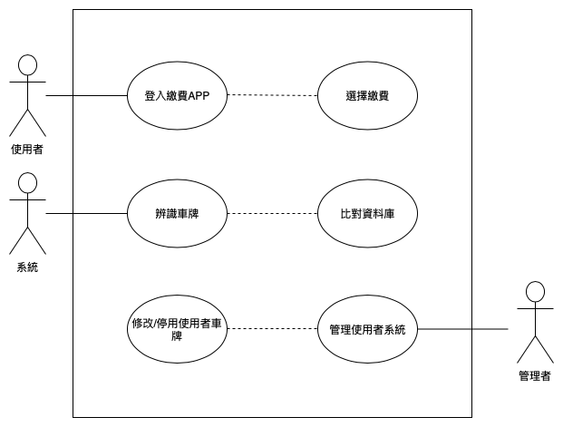

### 初步類別圖：

使用案例1：

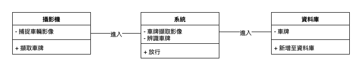

使用案例2：

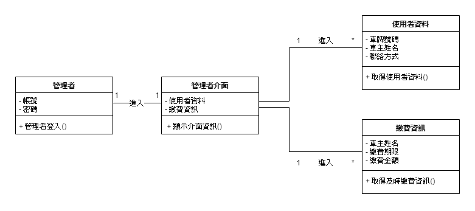

使用案例3：

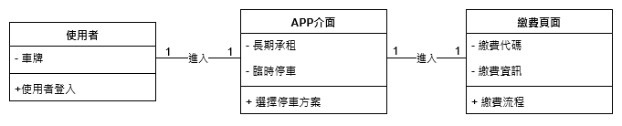

### 系統循序圖：

使用案例1：

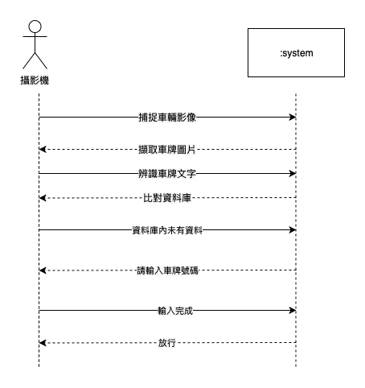

使用案例2：

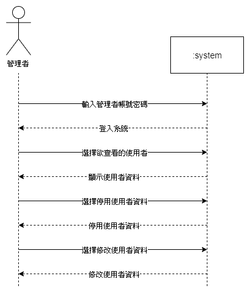

使用案例3：

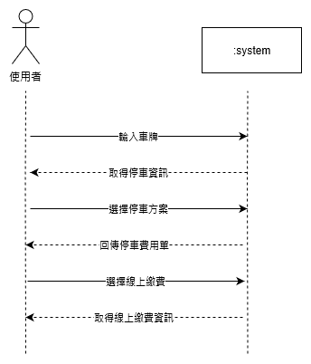

### 強韌圖：

使用案例1：

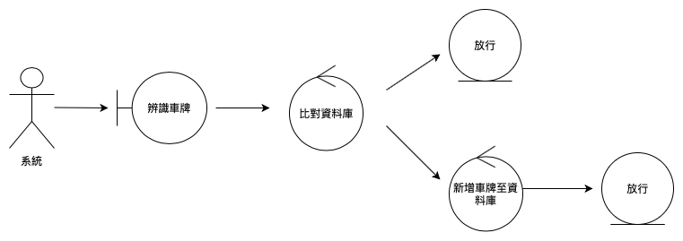

使用案例2：

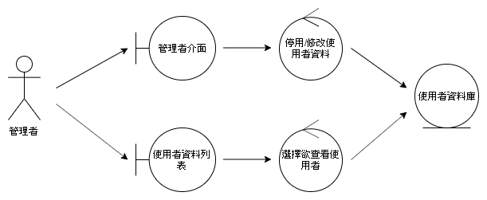

使用案例3：


### 循序圖：

使用案例1：

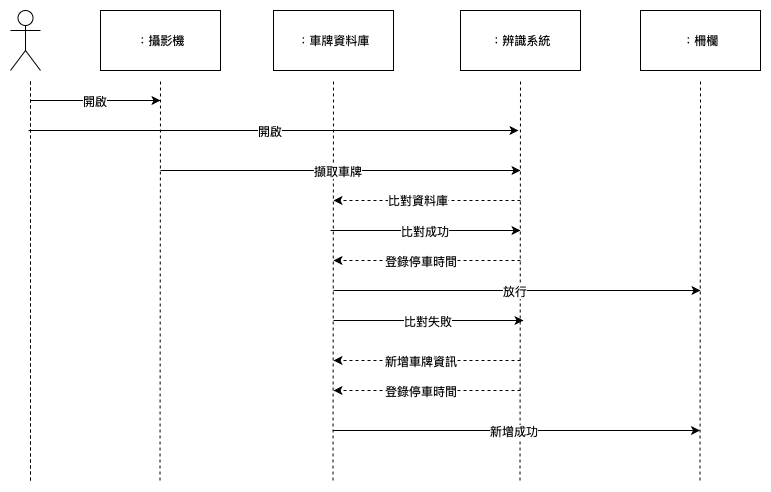

使用案例2：

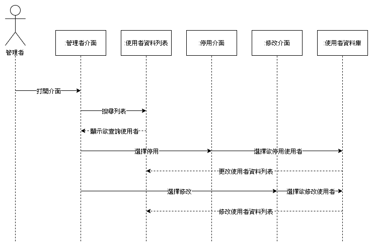

使用案例3：

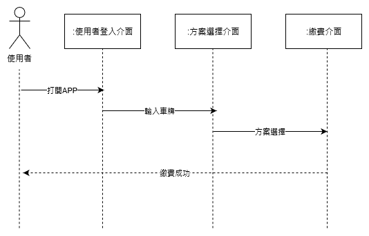


