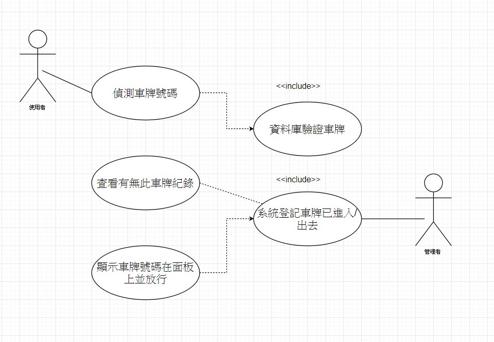

## 專題題目: 動態車牌辨識系統

### 需求清單
```
1. 英數字要能辨識
2. 如果圖片不夠清晰，要調整對比色彩
3. 一旦辨識成功，要輸出結果
4. 要能自動擷取車牌
```
### 非功能性需求 :

|需求類型|範例|
|:---|:---|
|操作性|系統能夠整合車牌資料庫|
|效能性|系統能在五秒內辨識出車牌|
|安全性|只有管理者能夠進入資料庫管理車牌系統|
|文化與政策性|系統能夠辨識大部分國家的車牌|

### 使用案例的重要性/使用案例 :
```
辨識車牌(長期承租)
1.捕捉車輛影像
2.擷取影像中的車牌圖片
3.辨識車牌文字
4.比對資料庫
5.資料庫中有資料即通行
```

```
辨識車牌(臨時停車)
1.捕捉車輛影像
2.擷取影像中的車牌圖片
3.辨識車牌文字
4.比對資料庫
5.資料庫中無資料，登記車牌號碼
```

```
繳費系統(手機APP)
1.與資料庫相連
2.選擇長期承租或臨時停車
3.輸入顧客車牌資料
4.產生繳費條碼
5.線上繳費成功
```

### user story :
```
1. 身為一個使用者，我希望能夠輕易辨識車牌，以便管理大量進出的車輛
2. 身為一個管理者，我希望能更精準地辨別車牌號碼，以便讓使用者選擇我的產品
```

### 使用案例圖：



### 初步類型圖：


